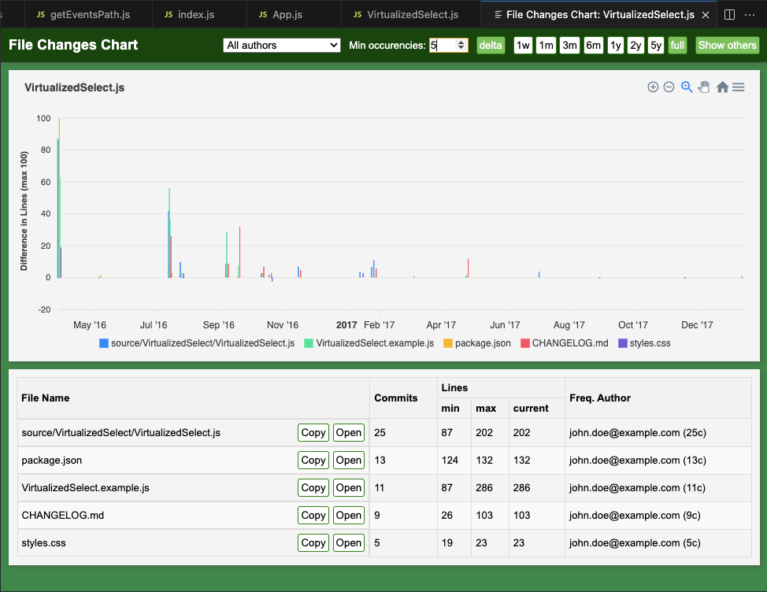

# File Changes Chart
An essential tool for developers to visualize relationships between files in a Git repository and detect “shotgun surgery” code smells, enhancing code maintainability.

## Overview
Maintaining large codebases often involves understanding how different files interact and change over time. File Changes Chart provides insights into these relationships by visualizing file changes across commits, helping you identify tightly coupled code and potential areas for refactoring.

## Screenshots

## Features
- Visualize File History:
- Track changes of the currently opened file throughout the Git commit history.
- Discover Related File Changes:
- Identify other files that were modified alongside the current file in the same commits.
- Detect Code Smells:
- Spot patterns indicative of “shotgun surgery,” where a single change impacts multiple files.
- Correlation Analysis:
- Analyze how changes in different files correlate over time to uncover hidden dependencies.

## How it works
The extension parses your Git commit history to:
- Extract change data for the selected file.
- Identify commits where multiple files were changed together.
- Generate interactive charts to visualize these relationships.

## Usage
- Open a file within your VS Code workspace.
- Activate the extension via the command palette or toolbar.
- View the generated chart displaying the file’s change history and related files.
- Interact with the chart to explore commit details and file correlations.

## Supported commands
Type `CTRL+Shift+P` (on Windows/Linux) and `CMD+Shift+P` (on Mac) and choose one of these command:
- `Show File Changes Chart` - showing the history of the currently active file
- `Show File Changes Chart With Others` - showing the history of the currently active file with all changed in the same commits
